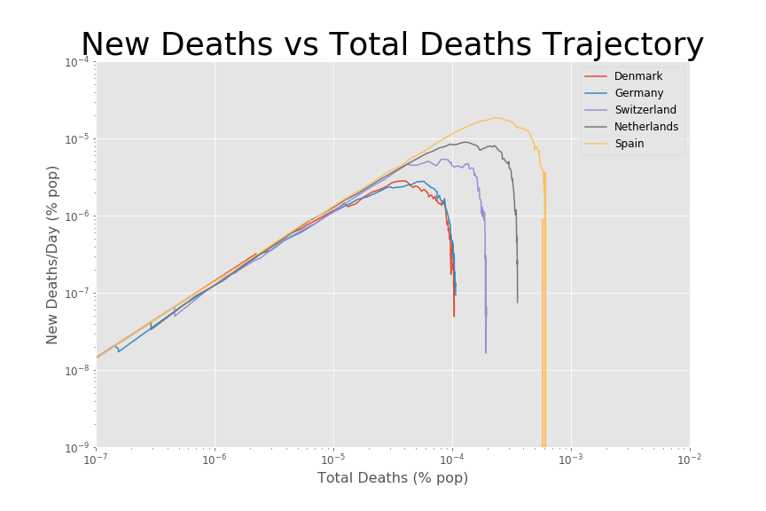

# Some Thoughts on the Coronavirus Data

To me it seems likely that many countries and states have already started reaching herd immunity.
This is based on several pieces of information.

## In some places, cases continue to fall exponentially, despite opening back up.

Our first case study is Italy, one of the first countries to experience a deadly outbreak outside China.
Cases exploded through early March, causing the government to declare lockdown on March 9, which wasn't lifted until May 18 [(source)](https://www.reuters.com/article/us-health-coronavirus-italy/a-beautiful-day-in-italy-as-shops-and-bars-finally-reopen-idUSKBN22U11R).
Notice how both the case counts and death counts were falling exponentially through June, even though the country had been open to travel, and people were going out to bars and restaurants.
If there hadn't been herd immunity, one would have expected the June cases to rise similarly to early March.
Instead they are falling below pre-lockdown levels.

Some other countries with similar patterns include Denmark, under lockdown from March 11 - May 18. [(source)](https://www.theguardian.com/commentisfree/2020/may/28/postcard-future-life-denmark-after-lockdown)

And New York, with lockdown from March 22 - June 8. [(source)](https://www.cnn.com/2020/06/08/us/new-york-reopening-coronavirus/index.html):

## In some places, there is a discrepancy between the trend in cases and the trend in deaths.

In some countries, deaths continue to fall even though cases are actually rising.
One possible explanation is bias from increased testing.
If new testing outpaces herd immunity, this will superficially look like a second wave, even if the true case counts are falling.
A few regions are shown below that demonstrate this phenomenon.

The point of this section is that my own preference is to focus on death counts rather than case counts, since they are probably less biased when looking at trends.
That isn't to say death counts aren't biased.
There has been some controversy around counting "deaths with covid" vs "deaths from covid" [(source)](https://www.scientificamerican.com/article/how-covid-19-deaths-are-counted1/),
and deaths not being counted as "from covid" before testing was widely available [(source)](https://www.cidrap.umn.edu/news-perspective/2020/07/about-30-covid-deaths-may-not-be-classified-such).
However, biases in deaths are probably not off by an order-of-magnitude, and biases that do exist are probably consistent across time, which is ok for trend-spotting.
Amount of testing, on the other hand, can increase or decrease by orders-of-magnitude, seriously skewing the results.
Therefore, the last section will look at deaths only.

## Viewing a country's trajectory using total deaths vs new deaths

The plots above showed both new deaths and total deaths as a percent of the population.
Assuming a country has reached herd immunity, once the new deaths get very low (<10^-6 or so) the total deaths are most likely close to their final values.
Below is a plot showing recent (since 6/26) average new daily deaths vs current total deaths.

Countries in the lower-right are close to herd-immunity, since they already have a high death count, but are getting only small increases per day.
This becomes more apparent when we plot the trajectories for these lower-right countries.

Countries in the middle-right are also near herd-immunity, with deaths still falling exponentially.

Countries in the upper-right have mostly rounded the top and are in the beginning stages of falling exponentially.

Countries in the far upper-right have yet to reach the top.

There's two main takeaways from these plots.
The first is that countries in the lower-right and middle-right have almost certainly reached herd immunity.
These are countries that are opening back up, yet the trajectories are still falling vertically.
The second takeaway is that the final death count seems to vary from 10^-4 to 10^-3.
I offer some explanations below, but honestly these are just random guesses:
- Death counts could be biased differently in different countries (explained earlier).
- Different countries might have different proportions of elderly population.
- Different populations might have different immunities to the virus.
- Different populations might have different pre-existing conditions (diabetes, heart problems, etc).
- Different populations might have done more social distancing/mask-wearing, which could have affected initial viral loads.

One last interesting plot is this one:

Each country has a different story here.
South Korea managed to eradicate the virus with aggresive contact-tracing and mandatory 14-day quarantines for all travelers [(source)](https://ourworldindata.org/covid-exemplar-south-korea).
New Zealand closed its borders and implemented strict lockdowns, bringing the case counts down to zero [(source)](https://www.cnbc.com/2020/05/05/how-new-zealand-brought-new-coronavirus-cases-down-to-zero.html).
Japan didn't really do anything different, leading BBC to call their low death rate 'mysterious' [(source)](https://www.bbc.com/news/world-asia-53188847).
I haven't found any good information on Australia's low death count, but recently there has been an updtick in cases [(source)](https://www.worldometers.info/coronavirus/country/australia/).
In any case, South Korea and New Zealand will probably have to remain cautious about opening their borders in the near future, since it seems they eradicated the virus without achieving herd immunity.

## Conclusions

These plots seem to show that many countries have already reached herd immunity, with more on the way, based on falling death counts.
My own prediction is that over the next couple months, case counts will start falling as well, once the rate of testing levels off.
Once case counts start falling, many people will start to come around to the herd immunity idea.
There will probably be a big political debate about whether we've actually reached herd immunity, with some people wanting to open 100% and others wanting to wait for a vaccine.
But since I think we've actually reached herd immunity, the data will win in the end, and I think that by Christmas everything will be open 100%.
